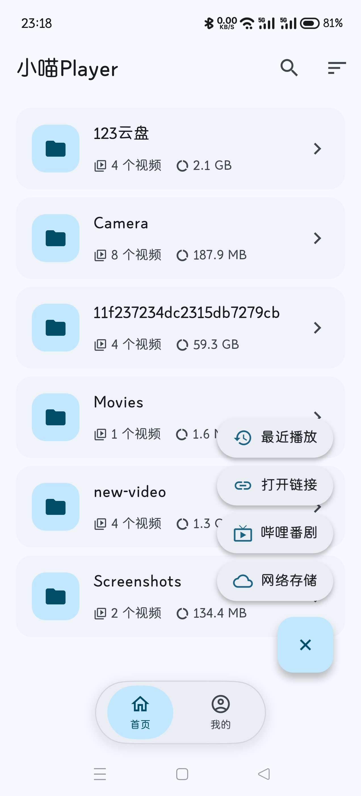
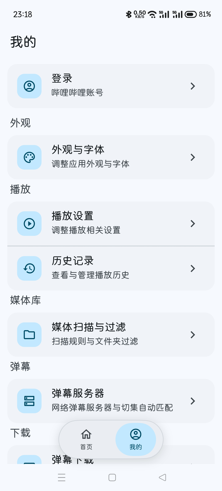
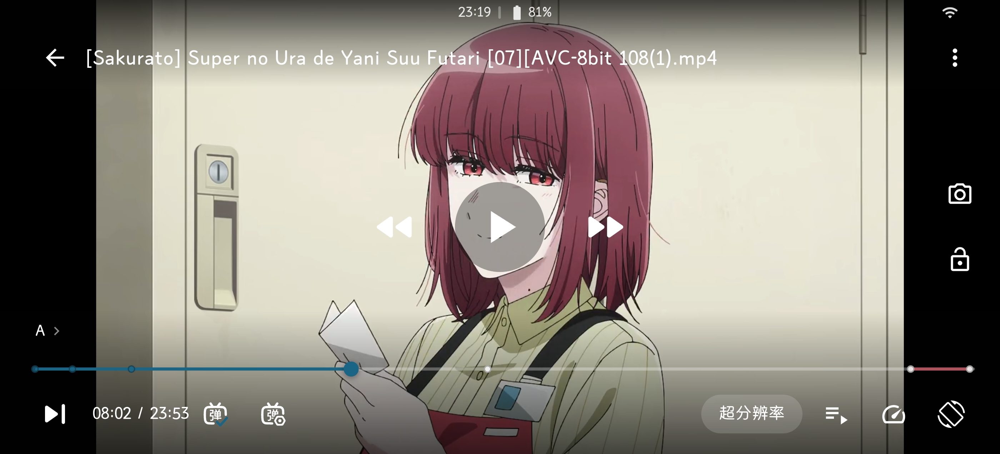
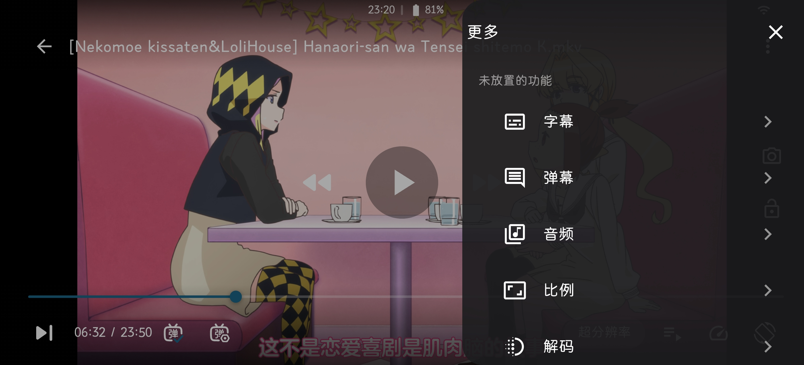

# 小喵 Player

  

  <b>小喵 Player</b> —— 面向 Android 的本地视频播放器，以本地媒体库播放为核心， 
  辅以在线播放、哔哩哔哩生态、网络存储、弹幕字幕、下载投屏等能力。

  
  
  

---

## 应用截图

<table align="center">
  <tr>
    <td align="center"> 首页（列表 / 树状视图）</td>
    <td align="center"> 我的 / 设置</td>
  </tr>
  <tr>
    <td align="center"> 播放页（横屏沉浸式）</td>
    <td align="center"> 播放页「更多」面板</td>
  </tr>
</table>

---

## 功能

### 媒体库 / 首页

| 功能 | 说明 |
|---|---|
| 两种浏览模式 | 列表模式与树状模式 |
| 视频扫描 | MediaStore 扫描 + 隐藏 / `.nomedia` 目录 |
| 排序与字段 | 名称 / 日期 / 大小 / 时长，字段可配置 |
| 黑白名单过滤 | 按路径规则包含或排除 |
| 固定文件夹 | 固定项稳定前置 |
| 多选批量操作 | 页面级多选 |
| 搜索 | 首页内搜索 |
| 速拨入口 | 最近播放 / 打开链接 / 番剧 / 网络存储 |
| 播放历史 | 记录 + 去重置顶 + 上限淘汰 |
| 播放进度 | 卡片显示进度与百分比 |
| 已观看阈值 | 默认 95%，可调 |
| 外部视频接入 | 「打开方式」直接播放 |
| 打开链接 | 输入直链在线播放 |

### 播放器

| 功能 | 说明 |
|---|---|
| 横屏沉浸式播放 | 全屏 + 控制层自动隐藏 |
| 竖屏播放页 | 与横屏共享同一播放实例 |
| 横竖屏零中断切换 | 切换不重新加载 |
| 双击手势 | 播放暂停 / 快进快退 / 关闭 |
| 水平滑动 seek | 带时间浮层与撤销 |
| 垂直滑动手势 | 调节音量与亮度 |
| 长按倍速 | 1–4x 步进 0.5 |
| 双指缩放 | 0.75–4x + 还原胶囊 |
| 进度条缩略图 | 拖动实时预览、所见即落点 |
| 章节名胶囊 | 预览气泡显示章节 |
| 章节列表 | 点击跳转 + 实时高亮 |
| 章节跳段 | 六类片段自动跳过 |
| 片头片尾跳过 | 按秒跳过，可一键重置 |
| 超分辨率 | Anime4K，7 档模式 × 3 档质量 |
| 画面比例 | 多种比例切换 |
| 解码方式 | 硬解 / 软解 + 解码预设 |
| 改档一键重启 | 解码配置变更后重启应用 |
| 播放诊断 | 缓存 / 丢帧 / 延迟 / 音画同步 |
| 音量增强 | 突破 100%，最高 200% |
| 截图 | 一键保存截图 |
| 锁定 | 锁定控制层防误触 |
| 画中画 | 显式入口进小窗 |
| 杜比视界引导 | 偏色检测与提示 |
| 顶部信息 | 时间 / 电量 / 网速 / 数据类型 |
| 自定义控制栏 | 槽位与按钮可编排 |
| 播放器设置 | 手势 / 方向 / 播放行为 / 阈值 |

### 音频

| 功能 | 说明 |
|---|---|
| 音轨切换 | 内嵌音轨单选 |
| 外部音轨 | 导入与移除 |
| 音轨自动回退 | 放不出声时自动切换 |
| 音频声道 | 自动 / 单声道 / 立体声 / 反向立体声 |
| 音频处理 | 音量标准化 / 动态范围压缩 |
| 均衡器 | 5 频段 + 低音增强 + 虚拟环绕 |
| 均衡器预设 | 6 个影视向预设 |
| 听视频 | 只播音频的独立页面 |
| 后台播放 | 前台服务保活 |
| 定时关闭 | 听视频睡眠定时 |
| 时间刻随机播放 | 按当前时间刻随机选曲 |
| 倍速播放 | 预设 + 精确调速 |

### 字幕

| 功能 | 说明 |
|---|---|
| 内嵌字幕轨 | 轨道单选 |
| 外挂字幕导入 | 系统 / 自建选择器 |
| 同名字幕自动加载 | 简繁后缀优先 |
| 字幕延迟 | 正负微调 |
| 字幕样式 | 大小 / 位置 / 颜色 / 描边 |
| 背景色与背景框 | RGBA 调色 + 框大小 |
| 内嵌样式覆盖 | 强制覆盖 ASS 样式 |
| 自定义字幕字体 | 目录批量导入 |
| 外挂字幕记忆 | 记住上次选择 |
| 影视字幕下载 | Wyzie 字幕源检索下载 |

### 弹幕

| 功能 | 说明 |
|---|---|
| 本地弹幕 | 同名 9 种命名规则自动加载 |
| 手动导入弹幕 | 弹幕文件选择器 |
| 网络弹幕 | 接入弹弹Play |
| 自动匹配 | 文件前 16MB MD5 匹配 |
| 切集自动匹配 | 按集数自动加载 |
| B 站原声弹幕 | 在线播放同步装载 |
| 弹幕服务器管理 | 默认 + 自建增删启停 |
| 搜索历史 | 关键词记录与清除 |
| 弹幕样式 | 字号 / 字重 / 速度 / 描边 / 不透明度 |
| 随机渐变色 | 忽略文件颜色 |
| 显示区域与行高 | 10% 档位 + 行高调节 |
| 三类显隐 | 顶部 / 底部 / 滚动 |
| 海量弹幕与去重 | 高密度场景优化 |
| 屏蔽词 | 关键词过滤 |
| 时间轴偏移 | ±180 秒 |
| 弹幕字体 | 跟随系统 / 跟随 App / 自定义 |

### 网络存储

| 功能 | 说明 |
|---|---|
| 三种协议 | WebDAV / SMB / FTP |
| 目录浏览 | 复用本地卡片组件 |
| 直连播放 | 本地代理供 mpv 拉流 |
| Range 与 seek | 支持分段请求 |
| 断线重连 | 死连接自动作废重连 |
| 超时与重试 | 统一分级超时 |
| FTP 中文编码 | UTF-8 / GBK 自适应 |
| 密码加密存储 | 只进系统加密存储 |

### 哔哩哔哩

| 功能 | 说明 |
|---|---|
| TV 扫码登录 | 含自动扫码与相册保存 |
| Cookie 导入 | 登录兜底方案 |
| 凭证加密 | 登录态安全存储 |
| 番剧索引 | 多维筛选 |
| 番剧搜索 | 支持分页 |
| 番剧详情 | 多季切换 + 选集 |
| 全屏选集页 | 30 集分段网格 |
| 追番时间表 | 更新日程 |
| 推荐 | 首页推荐网格 |
| 在线播放 | DASH 双流 |
| 清晰度切换 | 按账号权限回落 |
| 番剧剧集列表 | 下一集 / 连播 / 循环 |
| 原声弹幕 | 在线同步 |
| OP / ED 章节 | 精确片段 |
| 视频下载 | 清晰度 + 分 P 勾选 |
| 弹幕下载 | 按集数勾选 |

### 下载

| 功能 | 说明 |
|---|---|
| 任务队列 | 并发槽调度 |
| 断点续传 | Range 流式下载 |
| 暂停 / 恢复 / 重试 | 任务级控制 |
| 原生合并 | video + audio 合为 mp4 |
| 失败不损坏文件 | 中间文件 + 改名 |
| 任务持久化 | 跨重启保留 |
| 下载管理页 | 进度 / 速度 / 状态 |

### 投屏

| 功能 | 说明 |
|---|---|
| DLNA 设备发现 | SSDP 搜索 |
| 推流播放 | 本地文件推到电视 |
| 局域网媒体服务 | HTTP 分发 + Range |

### 文件管理

| 功能 | 说明 |
|---|---|
| 复制 / 移动 | 同卷秒移、跨卷自动退化 |
| 重命名 | 扩展名锁定 |
| 删除 | 默认只删视频文件 |
| 固定 / 取消固定 | 文件夹置顶 |
| 多选批量 | 批量执行动作 |
| 传输进度 | 进度与取消 |
| 重名避让 | 自动追加序号 |

### 外观与字体

| 功能 | 说明 |
|---|---|
| 23 种主题色 | 色块网格选择 |
| 21 种调色板风格 | flex_seed_scheme |
| 动态色 | Android 12+ 壁纸取色 |
| 自定义主题色 | 色相 / SV / hex 手输 |
| 明暗模式 | 浅色 / 深色 / AMOLED |
| 全局 App 字体 | 导入 + 字号字重 |

### 系统与设置

| 功能 | 说明 |
|---|---|
| 系统播放器注册 | 其他 App 可直接调用 |
| 设备信息 | HDR / 编码器 / 解码器清单 |
| 解码器详情 | 完整能力信息 |
| 缓存管理 | 封面与弹幕缓存清理 |
| 崩溃日志 | 查看 / 导出 / 清空 |
| 应用更新 | 检查更新与更新弹窗 |
| 隐私门禁 | 首次启动协议确认 |
| 隐私政策与协议 | 关于页查看正文 |
| 许可证书 | 开源许可全文 |

---

## 技术栈

| 项 | 说明 |
|---|---|
| 框架 | Flutter 3.44+ / Dart 3.12+ |
| 播放内核 | media_kit + 自建 libmpv（本地 fork，含抓帧接口 `mk_thumbnail_*`） |
| 状态管理 | `ChangeNotifier` + `ListenableBuilder` |
| 持久化 | `shared_preferences`；密钥类走 `flutter_secure_storage` |
| 弹幕渲染 | `canvas_danmaku` |
| 主题 | `flex_seed_scheme`（Material 3 色板派生） |
| 网络 | `http`（纯 Dart）+ `smb_connect`（本地 fork） |
| 原生 | Kotlin：MethodChannel `moumou/video_info` + 前台服务 + 崩溃处理 |

**完整技术文档**：[`docs/PROJECT.md`](docs/PROJECT.md) —— 逐文件职责、各模块实现说明、目录结构与分层约定、原生层。

---

## 致谢

本项目站在众多开源项目的肩膀上，特此致谢。以下按「基础能力 → 自建内核 → 上游库 → 参考项目」列出。

### 一、项目基础

本项目的骨架能力来自以下开源项目：

| 项目 | 用途 |
|---|---|
| [media-kit](https://github.com/media-kit/media-kit) | 播放内核 |
| [canvas_danmaku](https://github.com/Predidit/canvas_danmaku) | 弹幕渲染 |
| [Anime4K](https://github.com/bloc97/Anime4K) | 超分辨率着色器 |
| [弹弹Play](https://www.dandanplay.com/) | 网络弹幕 API |

### 二、自建内核

Android 播放内核由本项目自行编译（mpv + FFmpeg + libass + libplacebo 等）。
内核源码、构建脚本与自有改动说明：

- [libmpv-android-video-build-thumbnail](https://github.com/azxcvn/libmpv-android-video-build-thumbnail)
- 构建链路上游依赖：[FFmpeg](https://ffmpeg.org/) · [mpv](https://mpv.io/) · [libass](https://github.com/libass/libass) · [libplacebo](https://code.videolan.org/videolan/libplacebo) · [dav1d](https://code.videolan.org/videolan/dav1d) · [libxml2](https://gitlab.gnome.org/GNOME/libxml2) · [mbedTLS](https://github.com/Mbed-TLS/mbedtls) · [MediaInfoLib](https://mediaarea.net/MediaInfo)

### 三、上游库

本项目对以下库做了本地 fork（置于 `third_party/`，补丁与升级说明见各自 `FORK.md`），版权与许可证归原作者：

| 项目 | 用途 | 许可证 |
|---|---|---|
| [media_kit](https://github.com/media-kit/media-kit) | 播放器 API 层（新增运行时字体目录支持） | MIT |
| [smb_connect](https://github.com/ikanamori/smb_connect) | SMB 客户端（去掉全局串行锁以支持并发在途） | Apache-2.0 |
| [mediainfoAndroid](https://github.com/marlboro-advance/mediainfoAndroid) | MediaInfoLib 的 Android 绑定 | BSD-2-Clause |

### 四、参考项目

开发过程中参考了以下项目的设计与实现思路。参考面较广，不再逐条列举具体方向：

- [Kazumi](https://github.com/Predidit/Kazumi)
- [mpvRx](https://github.com/Riteshp2001/mpvRx)
- [PiliPlus](https://github.com/bggRGjQaUbCoE/PiliPlus)
- [Bili23-Downloader](https://github.com/ScottSloan/Bili23-Downloader) —— 设备指纹与 WBI 签名算法

### 五、图标素材

应用图标中的猫爪图案，灵感来自另一款应用图标左下角的猫爪元素，本项目将其提取后借助 AI 重绘为本应用图标。

### 六、其它依赖

各 Flutter / Dart 依赖与原生库的清单及其许可证见 [`THIRD_PARTY_NOTICES.md`](THIRD_PARTY_NOTICES.md)。

---

## 许可证

本项目基于 **[GNU General Public License v3.0](LICENSE)** 开源（copyleft）：

- 你可以自由使用、修改、分发本项目的代码；
- **任何衍生分发必须以同一许可（GPL-3.0）开源**，并提供完整对应源码，同时保留原作者版权声明。

第三方组件清单与各自许可证见 [`THIRD_PARTY_NOTICES.md`](THIRD_PARTY_NOTICES.md)；应用内「设置 → 关于 → 许可证书」页面亦可查看全部开源许可全文。
