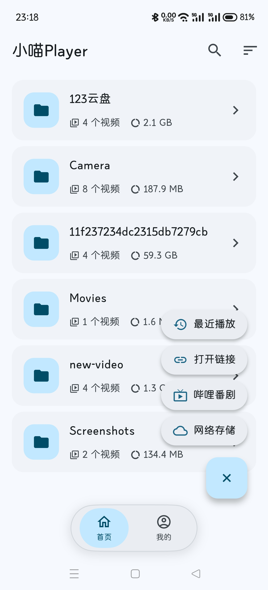
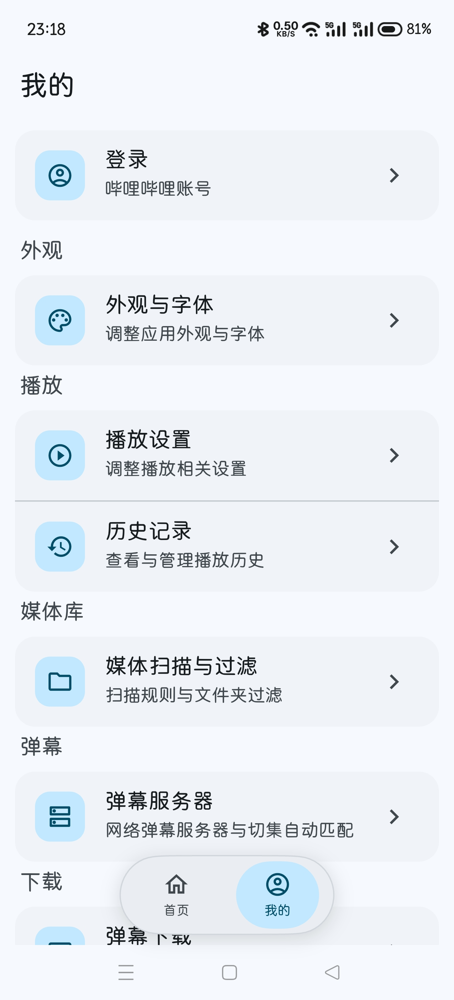
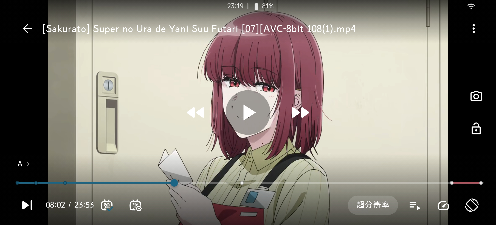
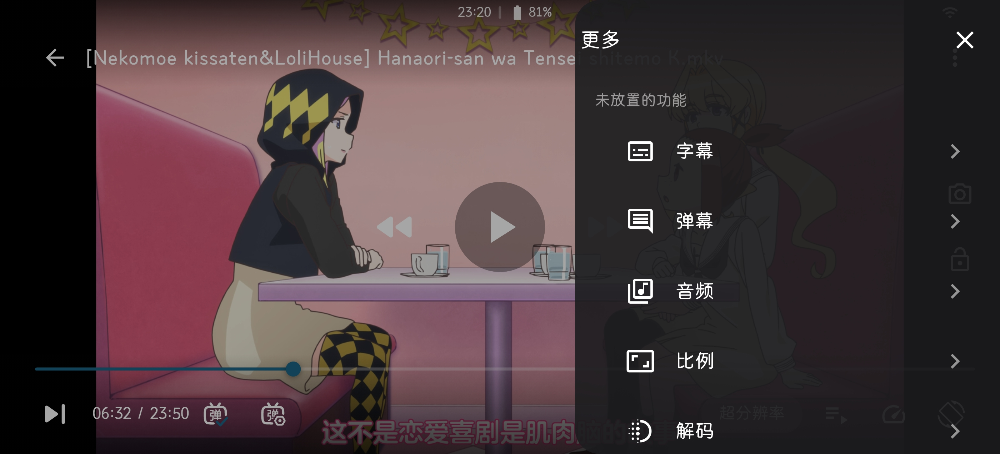

# 小喵 Player

  

  <b>小喵 Player</b> —— 面向 Android 的本地视频播放器，以本地媒体库播放为核心， 
  辅以在线播放、哔哩哔哩生态、网络存储、弹幕字幕、下载投屏等能力。

  
  
  

---

## 应用截图

<table align="center">
  <tr>
    <td align="center"> 首页（列表 / 树状视图）</td>
    <td align="center"> 我的 / 设置</td>
  </tr>
  <tr>
    <td align="center"> 播放页（横屏沉浸式）</td>
    <td align="center"> 播放页「更多」面板</td>
  </tr>
</table>

---

## 功能

### 媒体库 / 首页
列表 / 树状两种浏览模式 · MediaStore 扫描（含隐藏与 `.nomedia` 目录 —— [使用必看](docs/nomedia-scan-notice.md)） · 排序与字段可配置 · 黑白名单过滤 · 固定文件夹 · 多选批量 · 搜索 · 速拨入口 · 播放历史 · 播放进度 · 已观看阈值 · 外部视频接入 · 打开链接

### 播放器
横屏沉浸式播放 · 竖屏播放页 · 横竖屏零中断切换 · 双击手势 · 水平滑动 seek · 垂直滑动手势 · 长按倍速 · 双指缩放 · 进度条缩略图 · 章节名胶囊 · 章节列表 · 章节跳段 · 片头片尾跳过 · Anime4K 超分辨率 · 画面比例 · 解码方式（默认硬解+） · 改档一键重启 · 播放诊断 · 音量增强（最高 200%） · 截图 · 锁定 · 画中画 · 杜比视界引导 · 顶部信息 · 自定义控制栏 · 播放器设置

### 音频
音轨切换 · 外部音轨 · 音轨自动回退 · 音频声道（默认安全自动） · 音频处理 · 均衡器 · 均衡器预设 · 听视频 · 后台播放 · 定时关闭 · 时间刻随机播放 · 倍速播放

### 字幕
内嵌字幕轨 · 中文轨优先（默认开） · 外挂字幕导入 · 同名字幕自动加载 · 字幕延迟 · 字幕样式 · 背景色与背景框 · 内嵌样式覆盖 · 自定义字幕字体 · 外挂字幕记忆 · 影视字幕下载（Wyzie / 自定义地址）

### 弹幕
本地弹幕 · 手动导入弹幕 · 网络弹幕（弹弹Play） · 自动匹配 · 切集自动匹配 · B 站原声弹幕 · 弹幕服务器管理 · 搜索历史 · 弹幕样式 · 随机渐变色 · 指定颜色（多色调色板） · 显示区域与行高 · 三类显隐 · 海量弹幕与去重 · 屏蔽词 · 时间轴偏移 · 弹幕字体

### 网络存储
WebDAV / SMB / FTP · 目录浏览 · 直连播放 · Range 与 seek · 断线重连 · 超时与重试 · FTP 中文编码 · 密码加密存储

### 哔哩哔哩
TV 扫码登录 · Cookie 导入 · 凭证加密 · 番剧索引 · 番剧搜索 · 番剧详情 · 全屏选集页 · 追番时间表 · 推荐 · 在线播放 · 清晰度切换 · 番剧剧集列表 · 原声弹幕 · OP / ED 章节 · 视频下载 · 弹幕下载

### 下载
任务队列 · 断点续传 · 暂停 / 恢复 / 重试 · 原生合并 · 失败不损坏文件 · 任务持久化 · 下载管理页

### 投屏
DLNA 设备发现 · 推流播放 · 局域网媒体服务

### 文件管理
复制 / 移动 · 重命名 · 删除 · 固定 / 取消固定 · 多选批量 · 传输进度 · 重名避让

### 外观与字体
23 种主题色 · 21 种调色板风格 · 动态色（Android 12+） · 自定义主题色 · 明暗模式 · 全局 App 字体

### 系统与设置
系统播放器注册 · 设备信息 · 解码器详情 · 缓存管理 · 崩溃日志 · 应用更新 · 隐私门禁 · 隐私政策与协议 · 许可证书

---

## 技术栈

| 项 | 说明 |
|---|---|
| 框架 | Flutter 3.44+ / Dart 3.12+ |
| 播放内核 | media_kit + 自建 libmpv（本地 fork，含抓帧接口 `mk_thumbnail_*`） |
| 状态管理 | `ChangeNotifier` + `ListenableBuilder` |
| 持久化 | `shared_preferences`；密钥类走 `flutter_secure_storage` |
| 弹幕渲染 | `canvas_danmaku` |
| 主题 | `flex_seed_scheme`（Material 3 色板派生） |
| 网络 | `http`（纯 Dart）+ `smb_connect`（本地 fork） |
| 原生 | Kotlin：MethodChannel `moumou/video_info` + 前台服务 + 崩溃处理 |

**完整技术文档**：[`docs/PROJECT.md`](docs/PROJECT.md) —— 逐文件职责、各模块实现说明、目录结构与分层约定、原生层。

---

## 致谢

本项目站在众多开源项目的肩膀上，特此致谢。以下按「基础能力 → 自建内核 → 上游库 → 参考项目」列出。

### 一、项目基础

本项目的骨架能力来自以下开源项目：

| 项目 | 用途 |
|---|---|
| [media-kit](https://github.com/media-kit/media-kit) | 播放内核 |
| [canvas_danmaku](https://github.com/Predidit/canvas_danmaku) | 弹幕渲染 |
| [Anime4K](https://github.com/bloc97/Anime4K) | 超分辨率着色器 |
| [弹弹Play](https://www.dandanplay.com/) | 网络弹幕 API |

### 二、自建内核

Android 播放内核由本项目自行编译（mpv + FFmpeg + libass + libplacebo 等）。
内核源码、构建脚本与自有改动说明：

- [libmpv-android-video-build-thumbnail](https://github.com/azxcvn/libmpv-android-video-build-thumbnail)
- 构建链路上游依赖：[FFmpeg](https://ffmpeg.org/) · [mpv](https://mpv.io/) · [libass](https://github.com/libass/libass) · [libplacebo](https://code.videolan.org/videolan/libplacebo) · [dav1d](https://code.videolan.org/videolan/dav1d) · [libxml2](https://gitlab.gnome.org/GNOME/libxml2) · [mbedTLS](https://github.com/Mbed-TLS/mbedtls) · [MediaInfoLib](https://mediaarea.net/MediaInfo)

### 三、上游库

本项目对以下库做了本地 fork（置于 `third_party/`，补丁与升级说明见各自 `FORK.md`），版权与许可证归原作者：

| 项目 | 用途 | 许可证 |
|---|---|---|
| [media_kit](https://github.com/media-kit/media-kit) | 播放器 API 层（新增运行时字体目录支持） | MIT |
| [smb_connect](https://github.com/ikanamori/smb_connect) | SMB 客户端（去掉全局串行锁以支持并发在途） | Apache-2.0 |
| [mediainfoAndroid](https://github.com/marlboro-advance/mediainfoAndroid) | MediaInfoLib 的 Android 绑定 | BSD-2-Clause |

### 四、参考项目

开发过程中参考了以下项目的设计与实现思路。参考面较广，不再逐条列举具体方向：

- [Kazumi](https://github.com/Predidit/Kazumi)
- [mpvRx](https://github.com/Riteshp2001/mpvRx)
- [PiliPlus](https://github.com/bggRGjQaUbCoE/PiliPlus)
- [Bili23-Downloader](https://github.com/ScottSloan/Bili23-Downloader) —— 设备指纹与 WBI 签名算法

### 五、图标素材

应用图标中的猫爪图案，灵感来自另一款应用图标左下角的猫爪元素，本项目将其提取后借助 AI 重绘为本应用图标。

### 六、其它依赖

各 Flutter / Dart 依赖与原生库的清单及其许可证见 [`THIRD_PARTY_NOTICES.md`](THIRD_PARTY_NOTICES.md)。

---

## 许可证

本项目基于 **[GNU General Public License v3.0](LICENSE)** 开源（copyleft）：

- 你可以自由使用、修改、分发本项目的代码；
- **任何衍生分发必须以同一许可（GPL-3.0）开源**，并提供完整对应源码，同时保留原作者版权声明。

第三方组件清单与各自许可证见 [`THIRD_PARTY_NOTICES.md`](THIRD_PARTY_NOTICES.md)；应用内「设置 → 关于 → 许可证书」页面亦可查看全部开源许可全文。
