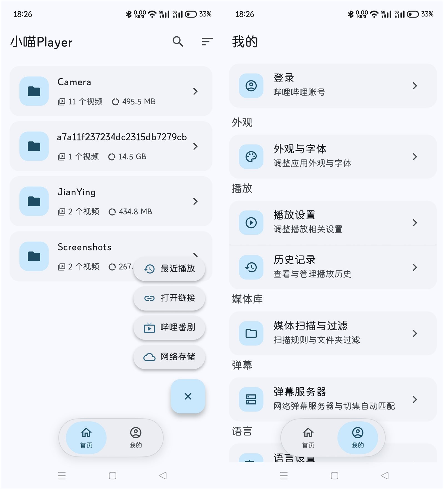
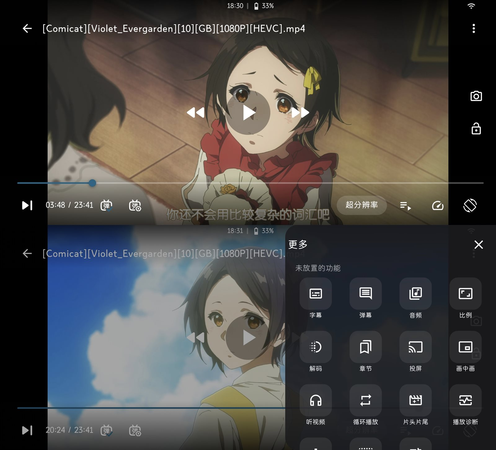
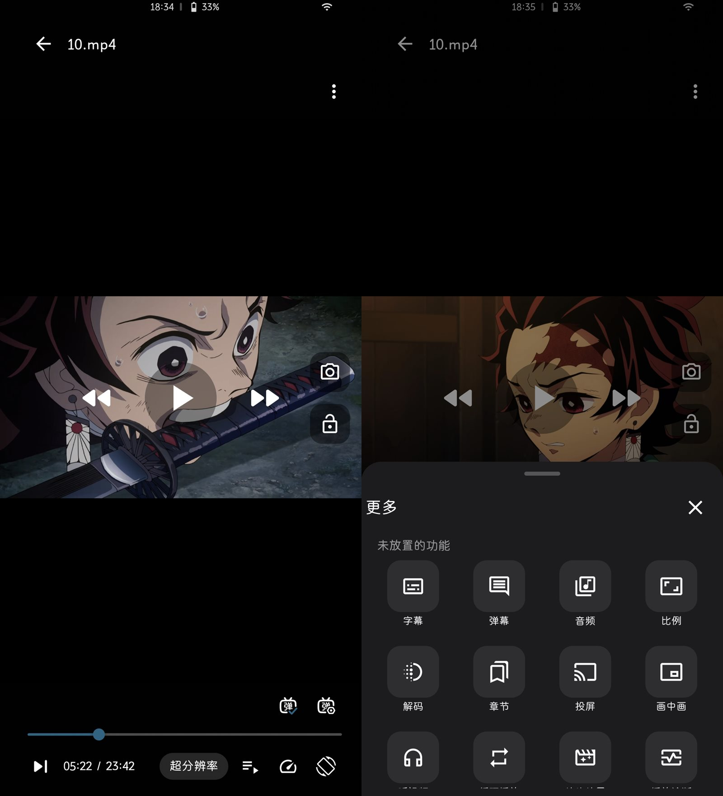
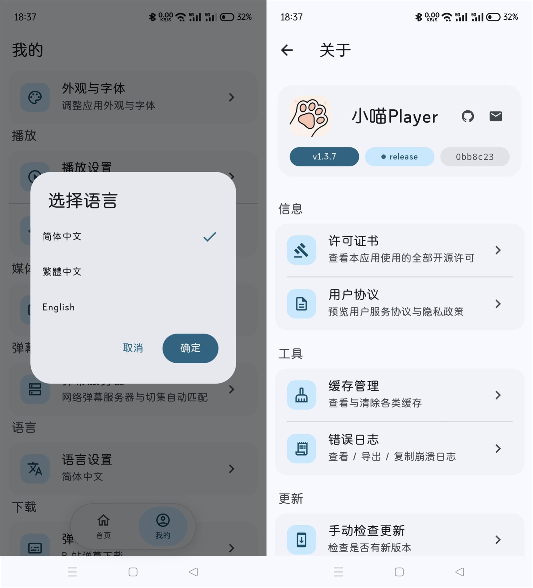

# 小喵 Player

  <a href="../README.md">简体中文</a> · <a href="README.en.md">English</a> · <b>繁體中文</b>

  

  <b>小喵 Player</b> —— 面向 Android 的本機影片播放器，以本機媒體庫播放為核心， 
  輔以線上播放、嗶哩嗶哩生態、網路儲存、彈幕字幕、下載投放等能力。

  
  
  

---

## 應用程式截圖

  
  

  
  

---

## 功能

### 媒體庫 / 首頁
清單 / 樹狀兩種瀏覽模式 · MediaStore 掃描（含隱藏與 `.nomedia` 目錄 —— [使用必看](nomedia-scan-notice.md)） · 排序與欄位可設定 · 黑名單/白名單過濾 · 固定資料夾 · 多選批次 · 搜尋 · 快速撥號入口 · 播放歷史 · 播放進度 · 已觀看閾值 · 外部影片接入 · 開啟連結

### 播放器
橫向沉浸式播放 · 直向播放頁 · 橫直向零中斷切換 · 雙擊手勢 · 水平滑動 seek · 垂直滑動手勢 · 長按播放速度 · 雙指縮放 · 進度條縮圖 · 章節名膠囊 · 章節清單 · 章節跳段 · 片頭片尾跳過 · Anime4K 超解析度 · 畫面比例 · 解碼方式（預設硬解+） · 改檔一鍵重新啟動 · 播放診斷 · 音量增強（最高 200%） · 截圖 · 鎖定 · 子母畫面 · 杜比視界引導 · 頂部資訊 · 自訂控制列 · 播放器設定

### 音訊
音軌切換 · 外部音軌 · 音軌自動回退 · 音訊聲道（預設安全自動） · 音訊處理 · 等化器 · 等化器預設 · 聽影片 · 背景播放 · 定時關閉 · 時間刻度隨機播放 · 倍速播放

### 字幕
內嵌字幕軌 · 中文軌優先（預設開啟） · 外掛字幕匯入 · 同名字幕自動載入 · 字幕延遲 · 字幕樣式 · 背景色與背景框 · 內嵌樣式覆蓋 · 自訂字幕字型 · 外掛字幕記憶 · 影視字幕下載（Wyzie / 自訂位址）

### 彈幕
本機彈幕 · 手動匯入彈幕 · 網路彈幕（彈彈Play） · 自動匹配 · 切集自動匹配 · B 站原聲彈幕 · 彈幕伺服器管理 · 搜尋歷史 · 彈幕樣式 · 隨機漸變色 · 指定顏色（多色調色盤） · 顯示區域與行高 · 三類顯隱 · 海量彈幕與去重 · 遮蔽詞 · 時間軸偏移 · 彈幕字型

### 網路儲存
WebDAV / SMB / FTP · 目錄瀏覽 · 直連播放 · Range 與 seek · 斷線重連 · 逾時與重試 · FTP 中文編碼 · 密碼加密儲存

### 嗶哩嗶哩
TV 掃碼登入 · Cookie 匯入 · 憑證加密 · 番劇索引 · 番劇搜尋 · 番劇詳情 · 全螢幕選集頁 · 追番時間表 · 推薦 · 線上播放 · 畫質切換 · 番劇劇集清單 · 原聲彈幕 · OP / ED 章節 · 影片下載 · 彈幕下載

### 下載
任務佇列 · 續傳 · 暫停 / 繼續 / 重試 · 原生合併 · 失敗不損壞檔案 · 任務持久化 · 下載管理頁

### 投放
DLNA 裝置探索 · 推流播放 · 區域網路媒體服務

### 檔案管理
複製 / 移動 · 重新命名 · 刪除 · 固定 / 取消固定 · 多選批次 · 傳輸進度 · 同名避讓

### 外觀與字型
23 種主題色 · 21 種調色盤風格 · 動態色（Android 12+） · 自訂主題色 · 明暗模式 · 全域 App 字型

### 系統與設定
系統播放器註冊 · 裝置資訊 · 解碼器詳細資訊 · 快取管理 · 當機日誌 · 應用程式更新 · 隱私門禁 · 隱私權政策與條款 · 授權條款

### 多語言
简体中文 / 繁體中文 / English 三種介面語言 · 首啟語言選擇窗 · 設定頁隨時切換、立即生效 · 隱私權政策與使用者條款三語言全文

---

## 技術棧

| 項 | 說明 |
|---|---|
| 框架 | Flutter 3.44+ / Dart 3.12+ |
| 播放核心 | media_kit + 自建 libmpv（本機 fork，含擷取畫格介面 `mk_thumbnail_*`） |
| 狀態管理 | `ChangeNotifier` + `ListenableBuilder` |
| 持久化 | `shared_preferences`；金鑰類走 `flutter_secure_storage` |
| 彈幕渲染 | `canvas_danmaku` |
| 主題 | `flex_seed_scheme`（Material 3 色盤派生） |
| 網路 | `http`（純 Dart）+ `smb_connect`（本機 fork） |
| 原生 | Kotlin：MethodChannel `moumou/video_info` + 前景服務 + 當機處理 |

**完整技術文件**：[`docs/PROJECT.md`](PROJECT.md) —— 逐檔案職責、各模組實作說明、目錄結構與分層約定、原生層。

---

## 致謝

本專案站在眾多開源專案的肩膀上，特此致謝。以下按「基礎能力 → 自建核心 → 上游函式庫 → 參考專案」列出。

### 一、專案基礎

本專案的骨架能力來自以下開源專案：

| 專案 | 用途 |
|---|---|
| [media-kit](https://github.com/media-kit/media-kit) | 播放核心 |
| [canvas_danmaku](https://github.com/Predidit/canvas_danmaku) | 彈幕渲染 |
| [Anime4K](https://github.com/bloc97/Anime4K) | 超解析度著色器 |
| [彈彈Play](https://www.dandanplay.com/) | 網路彈幕 API |

### 二、自建核心

Android 播放核心由本專案自行編譯（mpv + FFmpeg + libass + libplacebo 等）。
核心原始碼、建置指令碼與自有變更說明：

- [libmpv-android-video-build-thumbnail](https://github.com/azxcvn/libmpv-android-video-build-thumbnail)
- 建置鏈路上游相依：[FFmpeg](https://ffmpeg.org/) · [mpv](https://mpv.io/) · [libass](https://github.com/libass/libass) · [libplacebo](https://code.videolan.org/videolan/libplacebo) · [dav1d](https://code.videolan.org/videolan/dav1d) · [libxml2](https://gitlab.gnome.org/GNOME/libxml2) · [mbedTLS](https://github.com/Mbed-TLS/mbedtls) · [MediaInfoLib](https://mediaarea.net/MediaInfo)

### 三、上游函式庫

本專案對以下函式庫做了本機 fork（置於 `third_party/`，修補與升級說明見各自 `FORK.md`），著作權與授權條款歸原作者：

| 專案 | 用途 | 授權條款 |
|---|---|---|
| [media_kit](https://github.com/media-kit/media-kit) | 播放器 API 層（新增執行時字型目錄支援） | MIT |
| [smb_connect](https://github.com/ikanamori/smb_connect) | SMB 用戶端（移除全域串行鎖以支援並行在途） | Apache-2.0 |
| [mediainfoAndroid](https://github.com/marlboro-advance/mediainfoAndroid) | MediaInfoLib 的 Android 繫結 | BSD-2-Clause |

### 四、參考專案

開發過程中參考了以下專案的設計與實作思路。參考面較廣，不再逐條列舉具體方向：

- [Kazumi](https://github.com/Predidit/Kazumi)
- [mpvRx](https://github.com/Riteshp2001/mpvRx)
- [PiliPlus](https://github.com/bggRGjQaUbCoE/PiliPlus)
- [Bili23-Downloader](https://github.com/ScottSloan/Bili23-Downloader) —— 裝置指紋與 WBI 簽章演算法

### 五、圖示素材

應用程式圖示中的貓爪圖案，靈感來自另一款應用程式圖示左下角的貓爪元素，本專案將其擷取後借助 AI 重繪為本應用程式圖示。

### 六、其他相依

各 Flutter / Dart 相依與原生函式庫的清單及其授權條款見 [`THIRD_PARTY_NOTICES.md`](../THIRD_PARTY_NOTICES.md)。

---

## 授權條款

本專案基於 **[GNU General Public License v3.0](../LICENSE)** 開源（copyleft）：

- 你可以自由使用、修改、散布本專案的程式碼；
- **任何衍生散布必須以同一授權（GPL-3.0）開源**，並提供完整對應原始碼，同時保留原作者著作權聲明。

第三方元件清單與各自授權條款見 [`THIRD_PARTY_NOTICES.md`](../THIRD_PARTY_NOTICES.md)；應用程式內「設定 → 關於 → 授權條款」頁面亦可查看全部開源授權全文。
